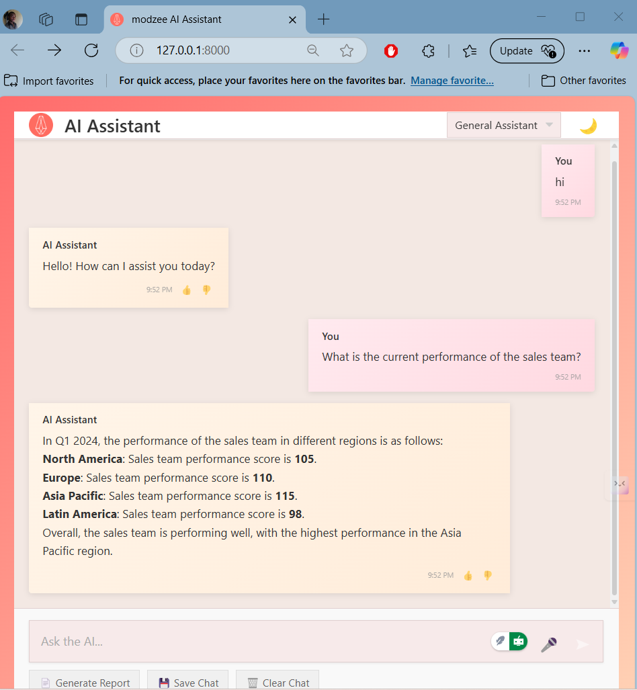

# AI-Powered Assistant Module for modzee (Laravel + Vue)

## 1. Project Overview

This project is a proof-of-concept AI Assistant feature built for modzee using the Laravel framework for the backend and Vue.js for the frontend. The assistant integrates with the OpenAI API (specifically designed for models like GPT-4, GPT-3.5-Turbo, or GPT-4o Mini) to provide contextual responses based on internal company data and fulfill specific tasks like report generation.

  

**Core Objectives:**
* Accept user prompts via a web interface.
* Send requests to the OpenAI API, potentially augmenting prompts with relevant business data.
* Return contextual and helpful responses from the AI.
* Display the conversation history and AI responses dynamically in the Vue.js UI.
* Follow secure coding practices. 

## 2. Features Implemented

* **Contextual Chat:** Ask questions related to internal data (Customers, Employees, Sales Data, Sales Targets, Teams). The backend attempts to inject relevant data into the prompt sent to OpenAI.
* **AI Report Generation:** Generate a team performance report based on employee data (triggered by a dedicated button).
* **Persona Selection:** Choose different AI assistant personas (General, Sales, HR, Technical) to influence response style.
* **Conversation History:** Chat history is displayed and persisted in the browser's localStorage.
* **Feedback:** Users can provide thumbs up/down feedback on AI responses, which is stored in the database.
* **Speech Recognition:** Users can dictate prompts using their microphone (requires browser support and permission).
* **Loading & Error States:** The UI indicates when the AI is processing and displays errors clearly.
* **(Bonus Implementation)** **Logging:** AI interactions (prompt, response, model, tokens, cost, context usage indication) are logged to the `ai_logs` database table.
* **(Bonus Implementation)** **Usage Tracking:** Basic usage tracking (tokens, cost) per user per month is implemented (requires `user_ai_usage` table and related model logic).

## 3. Technology Stack

* **Backend:** Laravel Framework
* **Frontend:** Vue.js (likely Vue 3 based on debugging)
* **AI:** OpenAI API (GPT-4 / GPT-3.5-Turbo / GPT-4o Mini recommended)
* **HTTP Client (Frontend):** Axios (via `aiService.js`)
* **HTTP Client (Backend):** Laravel HTTP Client / Guzzle (via `App\Services\OpenAi\Client`)
* **Database:** SQLite (for local development, as configured)
* **Styling:** CSS (with CSS variables for theming)
* **(Frontend Libraries):** `marked`, `dompurify` (for Markdown rendering)

## 4. Prerequisites

* PHP (Check `composer.json` for version, likely >= 8.1)
* Composer
* Node.js & npm (or yarn)
* A valid OpenAI API Key
* Web Server (Laravel Herd, Valet, Sail, XAMPP, etc. for local development)

## 5. Installation & Setup

1.  **Clone the Repository:**
    ```bash
    git clone https://github.com/kennybix/modzee-assistant.git
    cd modzee-assistant
    ```
2.  **Install PHP Dependencies:**
    ```bash
    composer install
    ```
3.  **Install NPM Dependencies:**
    ```bash
    npm install
    # or yarn install
    ```
4.  **Environment File:**
    * Copy the example environment file:
        ```bash
        cp .env.example .env
        ```
    * Generate the application key:
        ```bash
        php artisan key:generate
        ```
    * **Edit the `.env` file:**
        * Set your `OPENAI_API_KEY` obtained from OpenAI.
        * Verify the `DB_CONNECTION` is `sqlite`.
        * Verify `DB_DATABASE` points to the **absolute path** of your desired SQLite database file (e.g., `[Your Project Root]/database/database.sqlite`).
        * Set `OPENAI_MODEL` if you want to override the default (e.g., `gpt-4o`).
        ```dotenv
        APP_NAME="Modzee AI Assistant"
        APP_ENV=local
        APP_KEY=base64:...
        APP_DEBUG=true
        APP_URL=http://localhost

        DB_CONNECTION=sqlite
        # Make sure this is the ABSOLUTE path
        DB_DATABASE=/path/to/your/project/database/database.sqlite # <-- UPDATE THIS

        OPENAI_API_KEY="sk-YourActualOpenAiApiKey"
        OPENAI_MODEL="gpt-4o-mini" # Or your preferred model
        ```

5.  **Clear Configuration Cache:**
    ```bash
    php artisan config:clear
    ```

6.  **Database Migration:**
    * Ensure the SQLite file specified in `.env` doesn't exist or is empty if starting fresh.
    * Run the migrations to create the necessary tables (`users`, `ai_logs`, `ai_feedback`, `user_ai_usage`, etc.):
        ```bash
        php artisan migrate
        ```
    * *(If you encounter issues with migrations not running or tables missing, `php artisan migrate:fresh` can reset the database completely - **Warning: Deletes all data**)*

7.  **Build Frontend Assets:**
    ```bash
    npm run dev
    # or npm run build (for production assets)
    ```

## 6. Running the Application

1.  **Start the Development Server:**
    * If using Laravel Sail: `sail up`
    * If using Herd/Valet: Ensure it's running and serving your project directory.
    * If using standard PHP/webserver or `php artisan serve`:
        ```bash
        php artisan serve
        ```
2.  **Start the Frontend Build Process (if using `npm run dev`):** Keep the `npm run dev` process running in a separate terminal to handle hot module replacement.
3.  **Access the App:** Open your browser and navigate to the URL provided by your server (e.g., `http://127.0.0.1:8000` or your Valet/Herd URL).

## 7. Configuration

* **OpenAI:** API Key and default model are configured in the `.env` file and referenced in `config/services.php`.
* **Database:** Configured in `.env` (defaulting to SQLite).
* **AI Service Options:** Moderation, Caching, Personas can potentially be configured in `config/ai.php` or `config/services.php` (based on your final implementation).

## 8. API Endpoints

* `POST /api/ai/assistant`: Main endpoint for sending prompts and getting AI responses. [cite: 6]
* `POST /api/ai/report`: Endpoint for triggering the employee performance report generation.
* `POST /api/ai/feedback`: Endpoint for submitting feedback on AI responses.
<!-- * `GET /api/ai/usage`: Endpoint for retrieving user usage statistics (requires authentication). -->

## 9. Notes / Known Issues

* The context retrieval logic (`getContextDataForPrompt` in `OpenAiService`) uses basic keyword matching and might need refinement for more complex queries or larger datasets.
* Loading entire datasets (like all employees) as context can easily exceed OpenAI token limits. Filtering data within `AssistantDataService` is recommended for production.
<!-- * Usage tracking and cost estimation are basic; token counts might be estimated if not provided by the API response. -->
* Streaming is not currently implemented in the main chat flow.

---